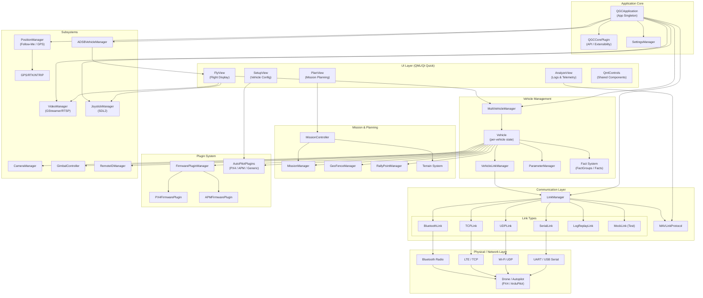
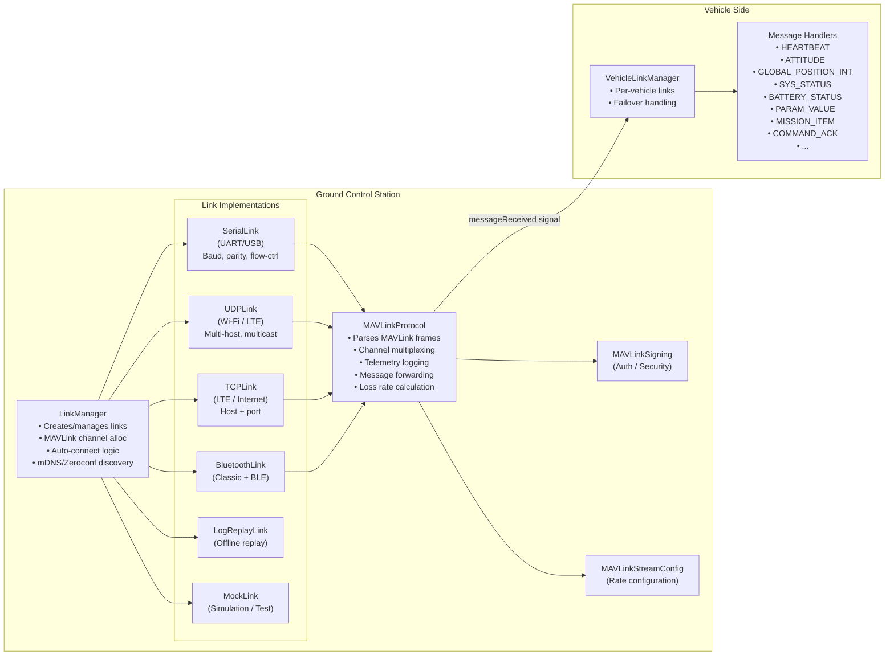
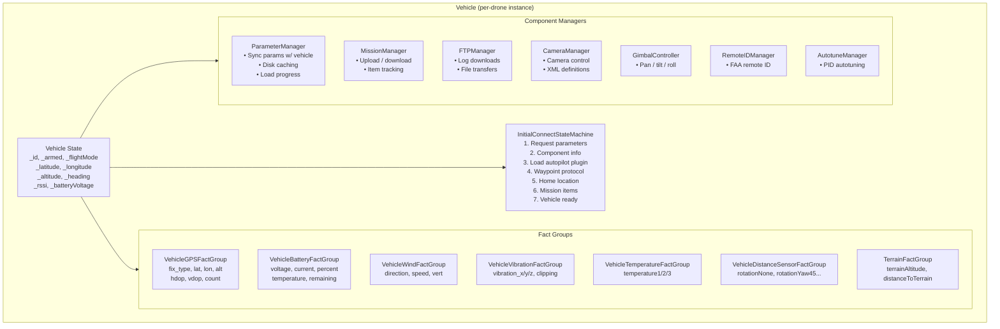
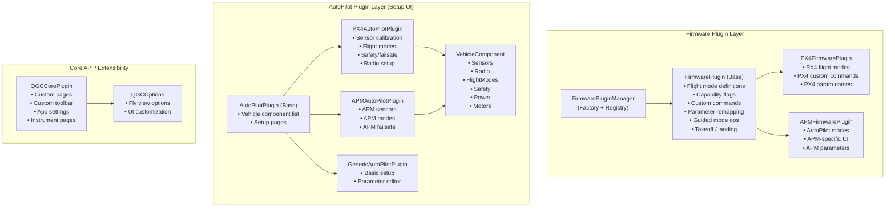
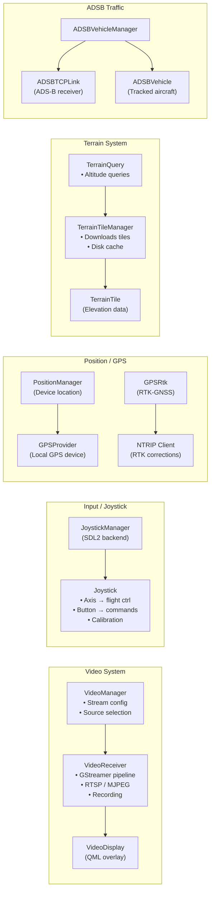
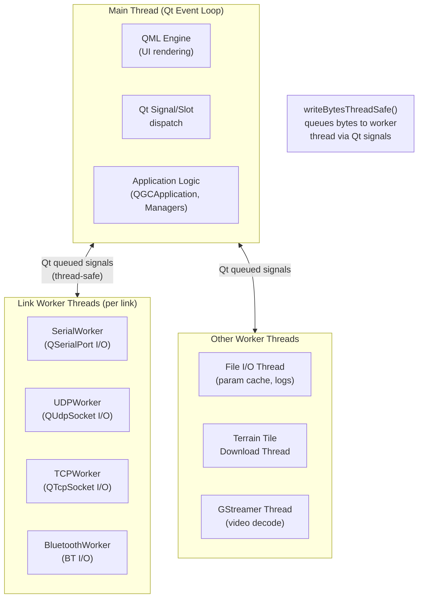
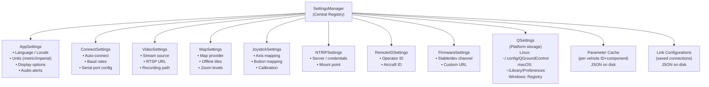

# QGroundControl Architecture Diagram

This document provides a comprehensive visual overview of the QGroundControl software and communication architecture using Mermaid diagrams.

## 1. Overall System Architecture



---

## 2. Communication Layer Detail



---

## 3. MAVLink Message Flow

```mermaid
sequenceDiagram
    participant Drone as Drone (Autopilot)
    participant Link as LinkInterface<br/>(Serial/UDP/TCP/BT)
    participant Proto as MAVLinkProtocol
    participant Vehicle as Vehicle
    participant FactGroup as FactGroup / Facts
    participant QML as QML UI

    Drone->>Link: Raw bytes (MAVLink frame)
    Link->>Proto: bytesReceived signal
    Proto->>Proto: mavlink_parse_char() decode
    Proto->>Vehicle: messageReceived signal
    Vehicle->>Vehicle: _handleIncomingMessage()
    Vehicle->>FactGroup: Update values (position, battery, GPS...)
    FactGroup->>QML: Q_PROPERTY notify signals
    QML->>QML: UI refresh

    Note over QML,Drone: Command Path (GCS → Drone)
    QML->>Vehicle: setArmed(true) / sendCommand()
    Vehicle->>Proto: MAV_CMD_COMPONENT_ARM_DISARM
    Proto->>Link: writeBytesThreadSafe()
    Link->>Drone: Raw bytes (MAVLink frame)
    Drone->>Vehicle: COMMAND_ACK (MAV_RESULT)
    Vehicle->>QML: armedChanged signal
```

---

## 4. Vehicle State & Fact System



---

## 5. Plugin Architecture



---

## 6. UI Component Hierarchy

```mermaid
graph TD
    MW["MainWindow.qml\n(Root)"]

    MW --> Header["ToolBar / Header\n• Connection status\n• Battery indicator\n• GPS indicator\n• Vehicle selector"]
    MW --> Views["View Router"]
    MW --> StatusBar["Status Bar\n• Flight time\n• Home distance\n• Altitude"]

    Views --> FV["FlyView\n(Live flight)"]
    Views --> PV["PlanView\n(Mission editor)"]
    Views --> SV["SetupView\n(Configuration)"]
    Views --> AV["AnalyzeView\n(Logs / Analysis)"]

    FV --> FlightDisp["FlightDisplayView\n• Video feed\n• Instrument overlay\n• Attitude indicator"]
    FV --> FlightMap["FlightMap\n• Vehicle track\n• Waypoint overlay\n• ADSB traffic"]
    FV --> ToolStrip["FlyViewToolStrip\n• Arm/Disarm\n• Takeoff/Land\n• RTL / Guided"]
    FV --> VJoy["VirtualJoystick"]
    FV --> GuidedAction["GuidedActionConfirm\n• Action dialogs"]
    FV --> MultiVeh["MultiVehicleList"]

    PV --> MissionEditor["Mission Editor\n• Waypoints\n• Survey patterns\n• Corridor scan\n• Structure scan"]
    PV --> GeoFenceEditor["GeoFence Editor"]
    PV --> RallyEditor["Rally Points Editor"]
    PV --> PlanToolBar["Plan ToolBar\n• Upload / Download\n• Clear / File ops"]

    SV --> Summary["Vehicle Summary"]
    SV --> FirmwareUpg["Firmware Upgrade"]
    SV --> SensorCal["Sensor Calibration"]
    SV --> RadioCal["Radio Calibration"]
    SV --> FlightModesCfg["Flight Modes Config"]

    AV --> MAVConsole["MAVLink Console"]
    AV --> MAVInspector["MAVLink Inspector"]
    AV --> LogDownload["Log Download"]
    AV --> TelemetryChart["Telemetry Charts"]
```



---

## 7. Subsystem Overview



---

## 8. Threading Model



---

## 9. Settings & Persistence


